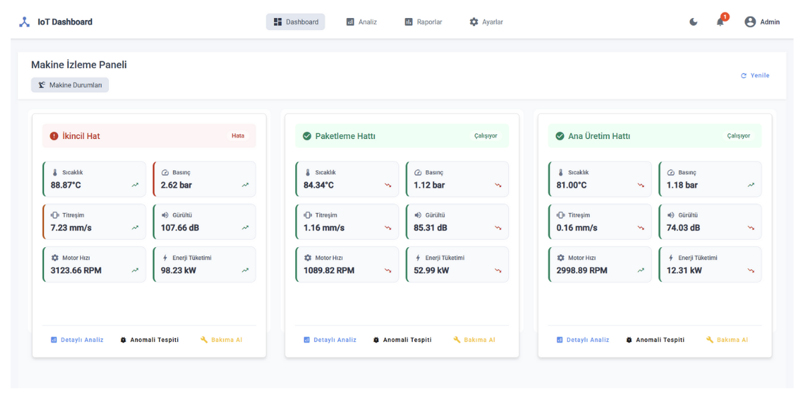

# IoT Dashboard UI

Bu proje, IoT cihazlarından gelen verileri görselleştirmek ve yönetmek için geliştirilmiş bir Angular tabanlı web uygulamasıdır.



## Özellikler

- IoT cihazlarından gelen verilerin gerçek zamanlı izlenmesi
- Veri görselleştirme ve grafikler (Chart.js kullanılarak)
- Cihaz yönetimi ve kontrol paneli
- Kullanıcı dostu arayüz
- Responsive tasarım

## Teknolojiler

- Angular 15+
- Angular Material
- Chart.js
- SignalR (gerçek zamanlı veri iletişimi için)
- Power BI entegrasyonu

## Kurulum

Projeyi yerel ortamınıza kurmak için aşağıdaki adımları izleyin:

1. Repoyu klonlayın:
```bash
git clone https://github.com/kullaniciadi/IoTDashboard-UI.git
cd IoTDashboard-UI
```

2. Bağımlılıkları yükleyin:
```bash
npm install
```

3. Geliştirme sunucusunu başlatın:
```bash
ng serve
```

4. Tarayıcınızda `http://localhost:4200/` adresine gidin.

## Geliştirme

### Kod Yapısı

- `src/app/core`: Çekirdek servisler, modeller ve yardımcı fonksiyonlar
- `src/app/features`: Uygulama özellikleri ve modülleri
- `src/app/shared`: Paylaşılan bileşenler, direktifler ve borular
- `src/app/services`: Uygulama servisleri

### Yeni Bileşen Oluşturma

Yeni bir bileşen oluşturmak için:

```bash
ng generate component features/yeni-bileşen-adı
```

## Derleme

Projeyi derlemek için:

```bash
ng build --prod
```

Derlenen dosyalar `dist/` dizininde saklanacaktır.

## Test

Birim testlerini çalıştırmak için:

```bash
ng test
```

## Katkıda Bulunma

1. Bu repoyu fork edin
2. Yeni bir özellik dalı oluşturun (`git checkout -b feature/amazing-feature`)
3. Değişikliklerinizi commit edin (`git commit -m 'Add some amazing feature'`)
4. Dalınıza push edin (`git push origin feature/amazing-feature`)
5. Pull Request açın

## Lisans

Bu proje MIT lisansı altında lisanslanmıştır. Detaylar için [LICENSE](LICENSE) dosyasına bakın.

## İletişim

Sorularınız veya önerileriniz için [issue açabilir](https://github.com/kullaniciadi/IoTDashboard-UI/issues) veya e-posta gönderebilirsiniz.
